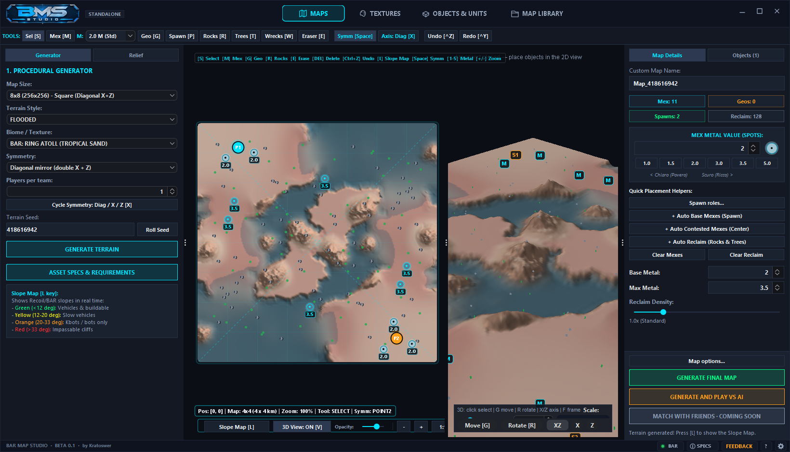
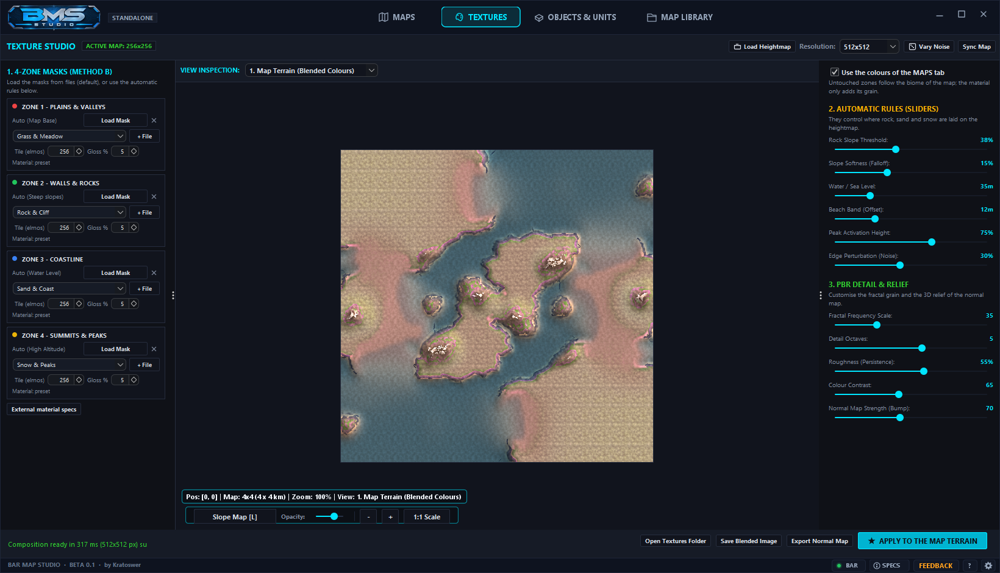
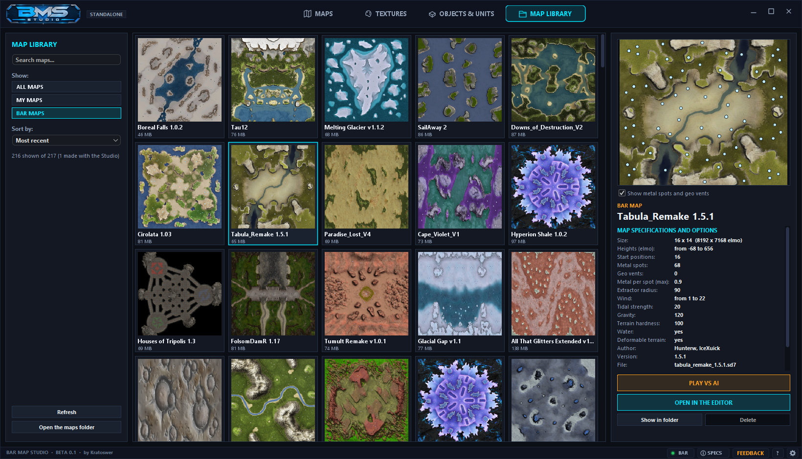
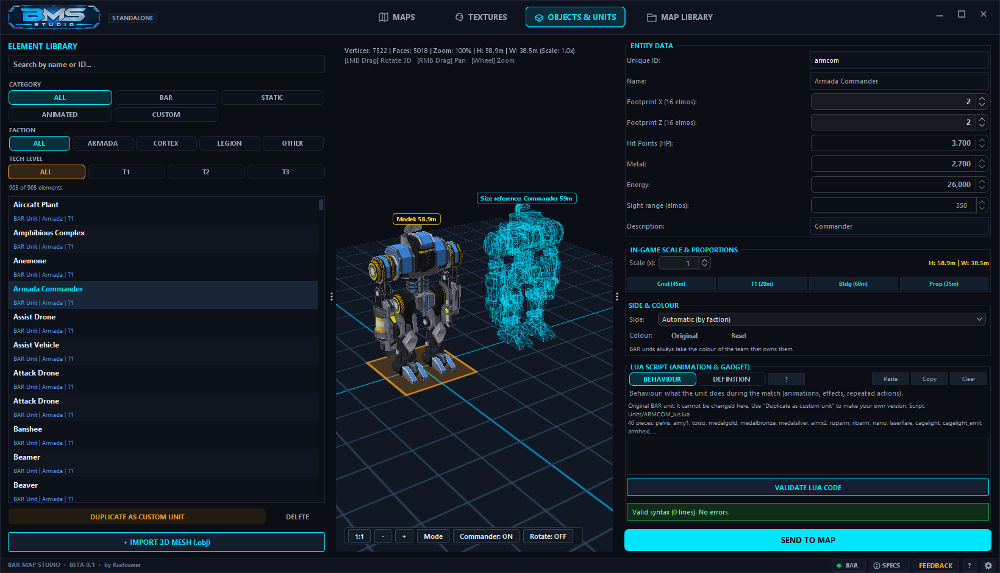

# BAR Map Studio

**Map and unit editor for [Beyond All Reason](https://www.beyondallreason.info).**
Generate a terrain, paint it, place metal and start points, build custom units, and play the result a minute later.

> Beta 0.1 by Kratoswer — unofficial tool, not affiliated with the Beyond All Reason team.

## Download

Click the button to download the installer, then run it.

- Windows may warn about an unknown publisher the first time: choose **More info → Run anyway**.
- The installer asks for administrator permission and proposes `C:\Program Files\BARMapStudio`; you can pick another folder.
- Your settings, cache and logs are kept apart from the program, in `%APPDATA%\BARMapStudio`, so an update never touches them.

Other files, on the **[Releases](https://github.com/Kratoswer-byte/barmapstudio/releases/latest)** page:

| File | For |
|---|---|
| `BARMapStudioSetup-…exe` | Windows installer (the button above) |
| `BARMapStudio-…-win.zip` | Windows, no installation: unzip and start `bar-map-launcher.bat` |
| `BARMapStudio-…-unix.tar.gz` | Linux and macOS — **not tested**, needs the full Java 25 (not the "headless" package). On macOS matches cannot be started from the Studio. |

## What you need

- Windows 10 or 11 (64 bit).
- Beyond All Reason installed and started at least once, so it has downloaded the game.

BAR Map Studio finds your BAR installation by itself, wherever it is installed. If it does not, press the **BAR** button at the bottom right, choose **Choose the BAR folder…** and pick the folder where BAR is installed. The same setting is in the gear menu.

## Your first map in five steps

1. Open the **MAPS** tab. Size, terrain style, biome and seed are already filled in, different at every start.
2. Press **GENERATE TERRAIN**. Not what you wanted? **Roll Seed** and generate again.
3. On the right press **+ Auto Base Mexes (Spawn)** and **+ Auto Contested Mexes (Center)** to place the metal.
4. Give the map a name.
5. Press **GENERATE AND PLAY VS AI**: the map is written into BAR and the match starts.

The [user guide](docs/GUIDE.md) covers everything else.

## What it does

- **Maps** — procedural generator with 29 terrain styles and the BAR biomes, live terrain shaping, symmetry tools, metal spots, geo vents, start points, rocks, trees and wrecks, slope map and 3D view. One click exports the map into BAR and starts a match against the AI.
- **Textures** — materials for the four terrain zones, automatic rules by height and slope, detail and relief.
- **Objects & Units** — browse every BAR unit in 3D, duplicate one as your own custom unit, change its name, stats, size, side and colour, and script it in Lua. Import your own `.obj` models.
- **Map Library** — all the maps installed in BAR with preview, size, heights, wind, tidal, metal and start positions. Open any of them in the editor or play it against the AI.
- English, Italian, French and German.

## Coming soon

- **Play with friends** — host a match on your own map with friends who only have BAR: the map reaches them by itself and they join with a double click. The feature is being finished and is not active in beta 0.1.

## Guide

- [User guide (English)](docs/GUIDE.md)
- [Guida per l'utente (italiano)](docs/GUIDA.md)

## Updates

When a newer version is published here, a green **UPDATE** button appears at the bottom right of the Studio. It shows what is new and can download and start the installer for you.

## Feedback

This is a beta: bug reports and ideas are welcome. Use the orange **FEEDBACK** button at the bottom right of the Studio. Nothing is sent until you press Send, and you see exactly what is attached.

## What the program sends over the internet

- At start it asks GitHub whether a newer version exists. Nothing about you is sent; GitHub sees your IP address like any site you visit.
- Your feedback, only when you press Send.
- Nothing else: no account, no statistics, no telemetry.

## Licence

BAR Map Studio is © 2026 Kratoswer, free to use for personal and non-commercial purposes. It is built on the [Neroxis Map Generator](https://github.com/FAForever/Neroxis-Map-Generator) (MIT License, © 2020 Peter Ziegler). The full text and the list of the libraries used are in `LICENSE.txt`, shipped with the program.

Beyond All Reason and its game content belong to their respective authors. BAR Map Studio reads the game files from your own installation and does not include them.
