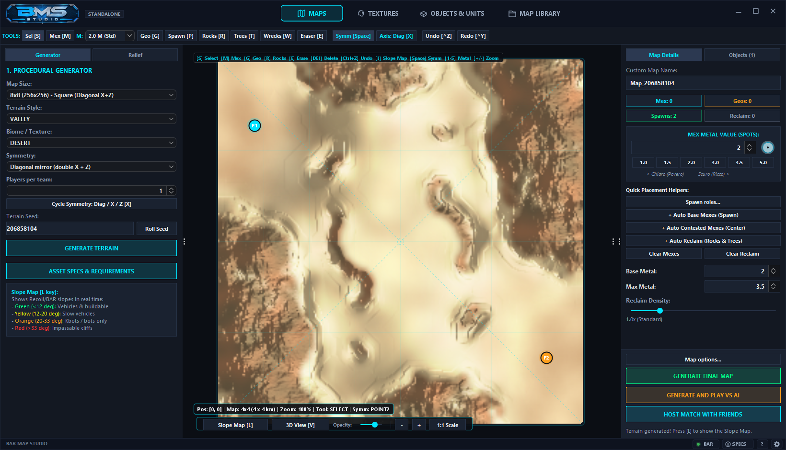
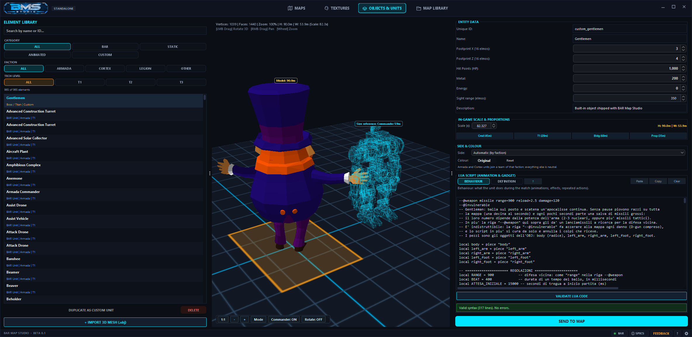
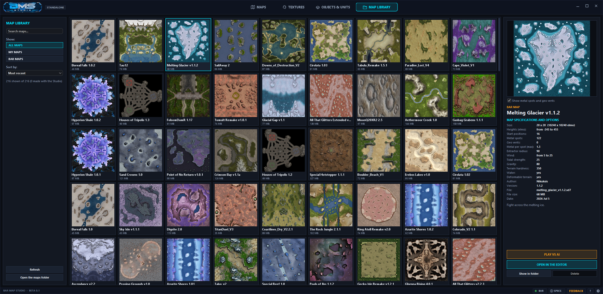

# BAR Map Studio — Guida per l'utente

Beta 0.1 · [English](GUIDE.md)

I nomi di pulsanti e schede sono riportati in inglese, la lingua predefinita del programma. Dal pulsante con l'ingranaggio in basso a destra puoi passare a italiano, francese o tedesco; il cambio vale dal prossimo avvio.

## Indice

1. [Installazione e primo avvio](#1-installazione-e-primo-avvio)
2. [La tua prima mappa in cinque minuti](#2-la-tua-prima-mappa-in-cinque-minuti)
3. [La scheda MAPS](#3-la-scheda-maps)
4. [La scheda TEXTURES](#4-la-scheda-textures)
5. [La scheda OBJECTS & UNITS](#5-la-scheda-objects--units)
6. [La scheda MAP LIBRARY](#6-la-scheda-map-library)
7. [Giocare con gli amici](#7-giocare-con-gli-amici)
8. [Aggiornamenti e feedback](#8-aggiornamenti-e-feedback)
9. [Dove stanno i tuoi file](#9-dove-stanno-i-tuoi-file)
10. [Problemi e soluzioni](#10-problemi-e-soluzioni)

---

## 1. Installazione e primo avvio

1. Installa **Beyond All Reason** e avvialo una volta, così scarica il gioco e il suo motore.
2. Esegui `BARMapStudioSetup-…exe`. Windows chiede il permesso di amministratore e propone `C:\Program Files\BARMapStudio`.
3. Avvia BAR Map Studio dal menu Start o dal collegamento sul desktop.

Lo Studio cerca da solo la tua installazione di BAR. La luce accanto a **BAR**, in basso a destra, è verde quando l'ha trovata. Se non lo è, premi **BAR** e scegli la cartella `data` della tua installazione (di solito `…\Beyond-All-Reason\data`).

## 2. La tua prima mappa in cinque minuti

1. Apri la scheda **MAPS**. Dimensione, stile del terreno, bioma e seed sono già compilati: stile, bioma e seed vengono scelti a caso a ogni avvio.
2. Premi **GENERATE TERRAIN**. Non ti piace? Premi **Roll Seed** e genera di nuovo.
3. A destra premi **+ Auto Base Mexes (Spawn)** e **+ Auto Contested Mexes (Center)** per piazzare il metallo.
4. Dai un nome alla mappa in **Custom Map Name**.
5. Premi **GENERATE AND PLAY VS AI**. La mappa viene scritta in BAR e la partita parte quando premi Conferma.

## 3. La scheda MAPS

### A sinistra: il generatore

| Controllo | A cosa serve |
|---|---|
| **Map Size** | Dimensione in unità di BAR (8x8, 12x12, 16x16…), quadrata o rettangolare. |
| **Terrain Style** | La forma del territorio: valli, altopiani, isole, canyon, corsie, crateri e altro. |
| **Biome / Texture** | L'aspetto del suolo. Le voci che iniziano con `BAR:` usano i biomi delle mappe ufficiali. |
| **Symmetry** | Come viene specchiata la mappa, perché ogni squadra abbia lo stesso terreno. |
| **Players per team** | Quanti punti di partenza ha ogni squadra. |
| **Terrain Seed** | Il numero da cui nasce il terreno: stesso seed e stesse impostazioni, stessa mappa. |

La sotto-scheda **Relief** rimodella dal vivo il terreno generato con dei cursori: profilo del rilievo (pianure più ampie oppure altopiani), ammorbidimento e terrazze. Riportandoli a 0 torna il terreno originale.

### In alto: gli strumenti

`Sel` seleziona e sposta · `Mex` punto metallo (il valore si sceglie accanto) · `Geo` geyser · `Spawn` punto di partenza · `Rocks`, `Trees`, `Wrecks` materiale da recuperare · `Eraser` gomma.
**Symm** ripete ogni azione sul lato specchiato; **Axis** cambia l'asse. **Undo / Redo** come sempre.
La lettera tra parentesi quadre è la scorciatoia da tastiera.

Sotto la mappa: **Slope Map [L]** colora il terreno in base alla pendenza (verde: veicoli, giallo: veicoli lenti, arancione: solo bot, rosso: invalicabile) e **3D View [V]** mostra la mappa in tre dimensioni.

### A destra: dettagli ed export

- **Map Details** — contatori, valore del metallo, pulsanti di piazzamento rapido, densità del materiale da recuperare.
- **Spawn roles…** — il ruolo consigliato a ogni punto di partenza (front, air, tech…). Partono tutti come *front*.
- **Map options…** — vento, marea, gravità, acqua e lava, raggio dell'estrattore, nebbia di guerra, e come inizia la partita: posizioni **statiche** (ogni squadra esattamente sulla sua base) oppure **zona di partenza** (i giocatori scelgono il punto dentro la zona della loro squadra).
- **GENERATE FINAL MAP** — scrive la mappa nella cartella mappe di BAR.
- **GENERATE AND PLAY VS AI** — come sopra, poi avvia una partita.
- **HOST MATCH WITH FRIENDS** — vedi il [capitolo 7](#7-giocare-con-gli-amici).

Esportando di nuovo con lo stesso nome, la mappa precedente viene sostituita.

## 4. La scheda TEXTURES

Il suolo di una mappa di BAR è dipinto con quattro materiali, uno per **zona**. Qui scegli quale materiale va in ogni zona e dove si trova ogni zona.

- **Materiali** — si scelgono tra i biomi di BAR, oppure carichi una tua immagine con **+ File**.
- **Regole automatiche** — le zone vengono assegnate in base a quota e pendenza: per esempio sabbia sul terreno basso e piatto, roccia sulle pareti.
- **Dettaglio e rilievo** — quanto è marcato il dettaglio fine di ogni materiale visto da vicino.
- **Sync Map** — ricarica la mappa aperta nella scheda MAPS.

I colori che vedi sono gli stessi usati dalla scheda MAPS e dalla mappa esportata.

## 5. La scheda OBJECTS & UNITS

### La libreria

A sinistra ci sono tutte le unità di BAR, più gli oggetti forniti con lo Studio. Filtra per **categoria**, **fazione** e **livello tecnologico**, oppure cerca per nome. Cliccando un'unità si carica il suo modello 3D; il comandante azzurro in fil di ferro accanto serve da riferimento per le dimensioni.

Le unità di BAR sono solo consultabili. Per modificarne una, selezionala e premi **DUPLICATE AS CUSTOM UNIT**: la copia è tua e compare sotto il filtro **CUSTOM**. **DELETE** elimina una copia, mai un originale.

**+ IMPORT 3D MESH (.obj)** importa un tuo modello.

### I dati di un'unità personalizzata

- **Entity data** — nome, descrizione, ingombro, punti vita, costo in metallo ed energia, raggio visivo.
- **In-game scale** — dimensione del modello, con valori pronti per comandante, T1, edificio e oggetto di scena.
- **Side & colour** — a chi appartiene l'unità sulla mappa: una fazione, una delle squadre, *ostile a tutti* oppure *neutrale*. Le unità di una fazione usano il colore della squadra; con ostile e neutrale il colore lo scegli tu.

### Behaviour e Definition

Un'unità personalizzata ha due testi Lua. Il pulsante **?** accanto alle due schede li spiega dentro il programma.

| | **BEHAVIOUR** | **DEFINITION** |
|---|---|---|
| Cos'è | Cosa **fa** l'unità | Com'è **fatta** l'unità |
| Quando viene letto | Durante la partita, per ogni copia dell'unità | Una volta sola, quando la partita si carica |
| A cosa serve | Animazioni, pezzi che si muovono, effetti, azioni che si ripetono, reazioni ai danni | Vita, costo, velocità, vista, armi, scudi, movimento |
| Esempio | Ogni 5 secondi l'unità danneggia tutto ciò che ha intorno | Dare all'unità lo scudo al plasma di un'altra unità |

Una copia parte con lo script dell'unità originale di BAR, pronto da modificare.

In **Definition** si usano brevi comandi dello Studio: `Studio.set`, `Studio.addWeapon`, `Studio.addShield`, `Studio.moveLike`. Il pulsante **Components…** elenca le unità di BAR con le loro armi, scudi e valori e scrive le righe al posto tuo.

**VALIDATE LUA CODE** controlla la sintassi. **SEND TO MAP** piazza l'unità sulla mappa aperta nella scheda MAPS.

Regola pratica: un numero o un equipaggiamento va in Definition; qualcosa che succede mentre si gioca va in Behaviour.

## 6. La scheda MAP LIBRARY

Tutte le mappe installate in BAR. Quelle create con lo Studio hanno l'etichetta verde **MINE**.

- **A sinistra** — ricerca, mostra tutte / le mie / quelle di BAR, ordina per data, nome o dimensione.
- **A destra** — anteprima con punti metallo e geyser, e le specifiche: dimensioni, quote, punti di partenza, metallo, raggio dell'estrattore, vento, marea, gravità, durezza, acqua, autore.
- **PLAY VS AI** — avvia una partita sulla mappa selezionata.
- **OPEN IN THE EDITOR** (o doppio clic) — carica terreno, texture, punti di partenza, metallo e geyser nella scheda MAPS.
- **Delete** — solo per le tue mappe. Quelle di BAR sono solo consultabili.

## 7. Giocare con gli amici

Ai tuoi amici basta avere Beyond All Reason: non serve lo Studio.

### Una volta sola: il tuo spazio cloud

La mappa deve stare in un posto da cui gli amici possano scaricarla. Lo Studio la carica in uno spazio compatibile S3 di tua proprietà (Cloudflare R2, Backblaze B2, Amazon S3).

1. Sul sito del fornitore crea un **bucket** e una **chiave di accesso**, e rendi il bucket leggibile pubblicamente.
2. Nello Studio: **HOST MATCH WITH FRIENDS → Cloud storage…**, poi inserisci endpoint, bucket, le due chiavi e l'indirizzo pubblico del bucket.
3. Premi **Test connection**.

Le chiavi restano nelle impostazioni utente del tuo PC. Non vengono mai scritte nelle mappe né nei file che mandi agli amici.

### A ogni partita

1. Apri o genera la mappa e premi **HOST MATCH WITH FRIENDS**.
2. Scrivi il tuo nome giocatore, i nomi degli amici (uno per riga), una password facoltativa e l'indirizzo a cui si collegano (**Detect** trova il tuo indirizzo pubblico).
3. Premi **HOST MATCH**. Lo Studio esporta la mappa, la carica, apre una cartella con un `join_NOME.bat` per ogni amico e avvia BAR come host.
4. Manda a ogni amico il suo file. Con un doppio clic scarica la mappa, la controlla, la installa ed entra nella tua partita.

L'ordine dei nomi decide le squadre: i giocatori vengono distribuiti a turno. I posti liberi li prende l'IA.

### Cosa serve perché funzioni

- Il tuo PC deve essere raggiungibile sulla **porta UDP 8452**: inoltra quella porta sul router, oppure usa una rete privata come Tailscale o ZeroTier e indica l'indirizzo di quella rete.
- Tutti devono avere la **tua stessa versione di BAR**. Basta aprire BAR una volta per aggiornarlo.
- Windows avvisa quando si apre un `.bat` scaricato: **Ulteriori informazioni → Esegui comunque**.

Vengono scritti anche i file `.sh` per Linux e macOS, ma non sono stati provati.

## 8. Aggiornamenti e feedback

- **UPDATE** (verde, in basso a destra) compare quando viene pubblicata una versione più recente. Mostra le novità e può scaricare e avviare l'installer. Lo Studio si chiude: salva prima il tuo lavoro.
- **FEEDBACK** (arancione, in basso a destra) manda all'autore la segnalazione di un errore o un'idea. Vedi i dettagli tecnici allegati (versione, sistema, ultimi errori) e puoi togliere la spunta. Non viene inviato nulla finché non premi Invia.

## 9. Dove stanno i tuoi file

| Cosa | Dove |
|---|---|
| Il programma | La cartella di installazione, di norma `C:\Program Files\BARMapStudio` |
| Impostazioni, cache, registri, le tue texture, copie dei feedback | `%APPDATA%\BARMapStudio` (per lo zip portabile, la cartella stessa del programma) |
| Mappe esportate | La cartella `maps` di BAR |
| File per gli amici | `matches` dentro la tua cartella dei dati |

La disinstallazione toglie il programma e conserva le tue impostazioni.

## 10. Problemi e soluzioni

| Problema | Cosa fare |
|---|---|
| La luce BAR è rossa | Premi **BAR** e scegli la cartella `data` della tua installazione. Avvia BAR una volta se non l'hai mai fatto. |
| L'elenco delle unità è vuoto | BAR non ha ancora scaricato il gioco: avvialo una volta. |
| «Play» non fa nulla | BAR non ha ancora il motore: avvialo una volta e lascia finire l'aggiornamento. |
| Windows chiede un permesso durante l'export | La cartella mappe di BAR è protetta. Consenti: il permesso serve solo a copiare la mappa. |
| In partita manca un'unità Legion, Scavengers o Raptors | Quelle unità richiedono la loro opzione di gioco. Lo Studio la attiva nelle partite che avvia. |
| Un amico non riesce a entrare | Controlla la porta UDP 8452 e che abbiate la stessa versione di BAR. |
| L'installer dice che non può creare una cartella | Avvialo da una cartella normale, come Download o il Desktop. |

Altro? Premi **FEEDBACK** e descrivi cosa hai fatto, cosa ti aspettavi e cosa è successo.
